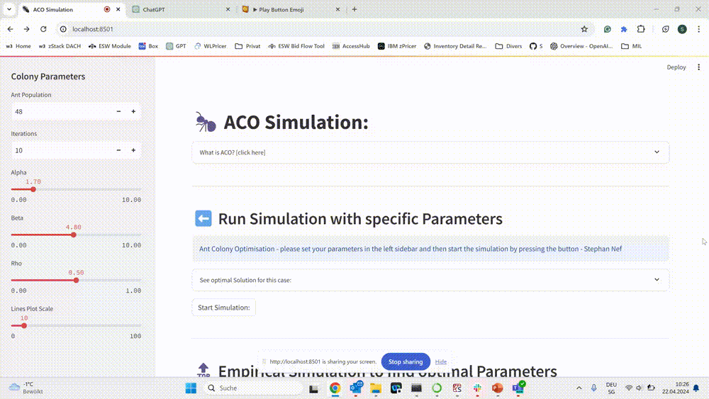
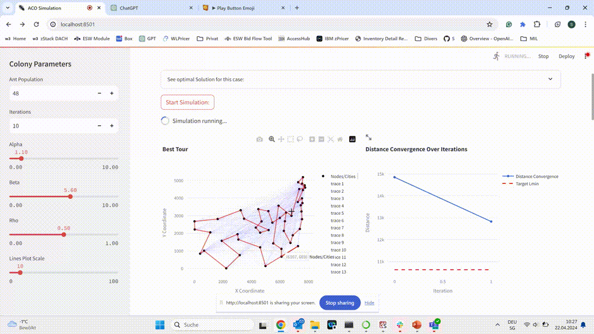
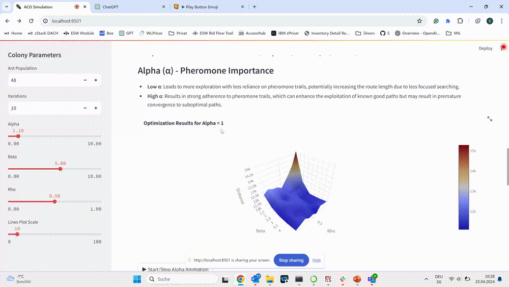

# Stigmergic interaction for Smart Colony Optimization - Simulation App
[Smart Colony Optimisation](https://smartcolonyoptimisation.streamlit.app/)

## Overview

This Application simulates an Ant Colony Optimization (ACO) algorithm. 
It allows users to interactively configure parameters, run simulations, and visualize the impact of different settings on the performance of the ACO algorithm.

The app is available publicly online at [Smart Colony Optimisation](https://smartcolonyoptimisation.streamlit.app/) until the end of this course.

## Features

- **Educational Content**: Expands on the theoretical background of ACO, helping users understand the underlying principles through interactive text and mathematical formulas.
- **Interactive Configuration**: Users can set various parameters such as ant population, number of iterations, and ACO coefficients (alpha, beta, and rho) through an intuitive sidebar.



- **Dynamic Visualization**: The application provides real-time visual feedback on the optimization process, showing both the path efficiency and the convergence over time.



- **Simulation Controls**: Users can start and stop the simulation at will, allowing for exploratory analysis and parameter tuning.



## How to Run

1. Clone this repository.
2. Ensure you have Python and Streamlit installed:
    ```bash
    pip install streamlit
    ```
3. Run the app:
    ```bash
    streamlit run app.py
    ```


## Simulation Setup

The app simulates an ant colony's behavior across different configurations to find the shortest path for visiting all cities and returning to the origin. Parameters include:

- **Ant Population**: Number of ants used in the simulation.
- **Iterations**: Number of cycles the ants will perform.
- **Alpha, Beta, Rho**: Coefficients controlling pheromone importance, heuristic information importance, and pheromone evaporation rate, respectively.

##Dependencies

Automatically generated by https://github.com/damnever/pigar.

numpy==1.24.3
pandas==2.0.3
plotly==5.18.0
streamlit==1.28.2
tsplib95==0.7.1


# Exercise 7: Stigmergic interaction for Smart Colony Optimization

This repository contains a partial implementation of an Ant System algorithm [1] for solving the [att48](http://comopt.ifi.uni-heidelberg.de/software/TSPLIB95/tsp/) Travelling Salesman Problem instance. 

[1] Dorigo, M., & Stützle, T. (2004). Ant colony optimization. The MIT Press.

## Table of Contents
- [Project structure](#project-structure)
- [How to run the project](#how-to-run-the-project)
- [Task 1](#task-1)
  - [Task 1.1](#task-11)
  - [Task 1.2](#task-12)
- [Task 2](#task-2)
  - [Task 2.1](#task-21)
  - [Task 2.2](#task-22)
  - [Task 2.3](#task-23)
- [Documentation](#documentation)

## Project structure
```bash
├── ant-colony.py # the ant colony that behaves base on the Ant System algorithm
├── ant.py # an artificial ant of the ant colony
├── environment.py # the environment of the ant colony
└── att48-specs # specification of the att48 TSP
    ├── att48.tsp # the specification of the TSP instance
    ├── att48.opt.tour # the optimal solution to the TSP instance
    ├── att48.opt.png 
    ├── att48_coordinates.txt 
    └── att48_distance_matrix.txt
```

## How to run the project
You can run the script `ant-colony.py` with [Python 3](https://www.python.org/downloads/): 

```shell
python3 ant-colony.py
```

## Task 1 

### Task 1.1 
Complete the implementation of [`environment.py`](environment.py):
- the constrcutor of the class `Environment` so that the environment is initialized based on the topology of the [att48](http://comopt.ifi.uni-heidelberg.de/software/TSPLIB95/tsp/) TSP instance;
- the function `initialize_pheromone_map()` for initializing the pheromone trails in the environment based on the Ant System algorithm.
  - HINT: The 3rd-party Python library [tsplib95](https://pypi.org/project/tsplib95/) enables parsing files of the TSPLIB library (e.g. TSP problem and solution files).
  - HINT: The book by (Dorigo and Stützle; 2004) provides directions for the initialization of the pheromone map in the Ant System algorithm.
  
### Task 1.2 
Complete the implementation of [`environment.py`](environment.py):
- the function `update_pheromone_map()` for updating the pheromone trails in the environment after each cycle based on the Ant System algorithm.

## Task 2

### Task 2.1
Complete the implementation of [`ant.py`](ant.py):
- the function `get_distance()` for enabling an ant to compute the pseudo-euclidean distance between two cities in the environment;
- the function `select_path()` for enabling an ant to select the next path to follow based on the Ant System algorithm. 
  - HINT: The specification of the pseudo-euclidean distance algorithm is available in the [TSPLIB95 documentation](http://comopt.ifi.uni-heidelberg.de/software/TSPLIB95/tsp95.pdf).
  
### Task 2.2 
Complete the implementation of [`ant.py`](ant.py):
- the function `run()` for enabling an ant to select and visit locations until it has visited all possible locations of its environment based on the Ant System algorithm.

### Task 2.3 
Complete the implementation of [`ant-colony.py`](ant-colony.py):
- the function `solve()` for producing a solution for the [att48](http://comopt.ifi.uni-heidelberg.de/software/TSPLIB95/tsp/) TSP instance based on the Ant System algorithm.
  - HINT: The book by (Dorigo and Stützle; 2004) provides directions for the parametrization of the Ant System algorithm.

## Documentation 
- [tsplib95 Python library API documentation](https://tsplib95.readthedocs.io/en/stable/) for working with TSPLIB 95 files (e.g., problem specifications);
- [tsplib95 glossary and documentation](http://comopt.ifi.uni-heidelberg.de/software/TSPLIB95/tsp95.pdf) for working with the pseudo-euclidean distance algorithm;
- (Dorigo and Stützle; 2004) Dorigo, M., & Stutzle, T. (2004). Ant colony optimization. The MIT Press; for working with the TSP and the Ant System algorithm;
- [Lecture slides; slides 18-42](https://learning.unisg.ch/courses/19882/files/2757800?module_item_id=564752).
